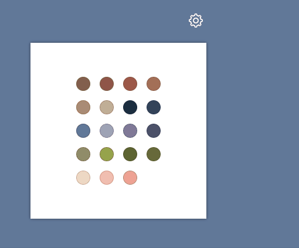

<p align="center">
    
</p>
<h1 align="center">
    svelte-use-drop-outside
</h1>
<p align="center">
    Svelte action to drop an element outside an area and more...
</p>

---

[](https://www.npmjs.com/package/@untemps/svelte-use-drop-outside)
[](https://github.com/untemps/svelte-use-drop-outside/actions)
[](https://lgtm.com/projects/g/untemps/svelte-use-drop-outside/context:javascript)

## Demo

<p align="center">
    :red_circle:&nbsp;<big><a href="https://svelte-use-drop-outside.vercel.app/" target="_blank" rel="noopener">LIVE DEMO</a></big>&nbsp;:red_circle:
</p>

## Installation

```bash
yarn add @untemps/svelte-use-drop-outside
```

## Usage

### Basic usage

```svelte
<script>
    import { useDropOutside } from '@untemps/svelte-use-drop-outside'
    
    const _onDropOutside = (node) => {
        console.log(`You\'ve just dropped #${node.id} outside the area`)
    }
</script>

<main>
    <div class="container">
        <div class="area">
            <div
                id="target"
                use:useDropOutside={{
                    areaSelector: '.area',
                    onDropOutside: _onDropOutside,
                }}
                class="target"
            >
                Drag me outside the white area
            </div>
        </div>
    </div>
</main>

<style>
    main {
        display: flex;
        align-items: center;
        justify-content: center;
        height: 100%;
        padding: 1rem;
        background-color: #617899;
    }
    
    .container {
        max-width: 640px;
        display: flex;
        flex-direction: column;
        align-items: center;
        row-gap: 3rem;
    }
    
    .area {
        width: 300px;
        height: 300px;
        display: flex;
        align-items: center;
        justify-content: center;
        background-color: white;
        box-shadow: 0 0 5px 0 rgba(0, 0, 0, 0.5);
    }
    
    .target {
        width: 10rem;
        background-color: black;
        color: white;
        text-align: center;
        display: flex;
        align-items: center;
        justify-content: center;
        padding: 1rem;
    }
</style>
```

## API

| Props                 | Type                        | Default            | Description                                                             |
|-----------------------|-----------------------------|--------------------|-------------------------------------------------------------------------|
| `areaSelector`        | string                      | null               | Selector of the element considered as the "inside" area.                |
| `dragImage`           | element or object or string | null               | The image used when the element is dragging.                            |
| `dragClassName`       | string                      | null               | A class name that will be assigned to the dragged element.           |
| `onDropOutside`       | function                    | null               | Callback triggered when the dragged element is dropped outside the area. |
| `onDropInside`        | function                    | null               | Callback triggered when the dragged element is dropped inside the area  |
| `onDragCancel`        | function                    | null               | Callback triggered when the drag is cancelled (Esc key)                 |

### Area Selector

You can define the DOM element which will be treated as the "inside" area by passing the [selector](https://developer.mozilla.org/fr/docs/Web/API/Document/querySelector) of this element.

When dropping the dragged element, the action reconciles the boundaries of this element with the boundaries of the area to assert inside/outside stuff.

When pressing the `Escape` key, wherever the dragged element is, it is put back to its original position.

### Drag Image

By default, the action clones the target element and sets its opacity to `0.7`.

Alternately, you may use the `dragImage` prop to customize the image displayed during the drag.

The `dragImage` prop may be:

#### A DOM element such a `` or a `<template>`:

```svelte
<main>
    <div class="container">
        <div class="area">
            <div
                id="target"
                use:useDropOutside={{
                    areaSelector: '.area',
                    dragImage: document.querySelector('#drag-image'),
                }}
                class="target"
            >
                Drag me outside the white area
            </div>
        </div>
    </div>
</main>

```

#### An object with 3 properties:

| Props    | Description                     |
|----------|---------------------------------|
| `src`    | Path of the image.              |
| `width`  | Width of the image (optional).  |
| `height` | Height of the image (optional). |

```svelte
<main>
    <div class="container">
        <div class="area">
            <div
                id="target"
                use:useDropOutside={{
                    areaSelector: '.area',
                    dragImage: {
                        src: './assets/drag-image.png',
                        width: 48,
                        height: 48
                    },
                }}
                class="target"
            >
                Drag me outside the white area
            </div>
        </div>
    </div>
</main>
```

#### A string as path of the image:

```svelte
<main>
    <div class="container">
        <div class="area">
            <div
                id="target"
                use:useDropOutside={{
                    areaSelector: '.area',
                    dragImage: './assets/drag-image.png',
                }}
                class="target"
            >
                Drag me outside the white area
            </div>
        </div>
    </div>
</main>
```

### Drag styles

You may assign a class to the dragged element to customize its display whether it is a clone of the target element or it is an image by using the `dragClassName` prop.

> Please note the class has to be global

```svelte
<main>
    <div class="container">
        <div class="area">
            <div
                id="target"
                use:useDropOutside={{
                    areaSelector: '.area',
                    dragClassName: 'custom-drag',
                }}
                class="target"
            >
                Drag me outside the white area
            </div>
        </div>
    </div>
</main>

<style>
    .target {
        background-color: black;
    }
    
    :global(.custom-drag) {
        opacity: .5;
        background-color: red;
    }
</style>
```

### Callbacks

All callbacks are triggered with the following arguments:

| Argument | Description                               |
|----------|-------------------------------------------|
| [0]      | Dragged element.                          |
| [1]      | Element considered as the "inside" area. |

```javascript
const _onDropOutside = (node, area) => {
  console.log(`You\'ve just dropped #${node.id} outside the #${area.id}`)
}

const _onDropInside = (node, area) => {
  console.log(`You\'ve just dropped #${node.id} inside the #${area.id}`)
}

const _onDragCancel = (node, area) => {
  console.log(`You\'ve just cancelled the drag of #${node.id} against #${area.id} boundaries`)
}
```

## Recipes

### Switching Container

You may use the action to implement a classic drag and drop container switch using the `onDropInside` callback:

<p align="center">
    
</p>

```svelte
<script>
    import { useDropOutside } from '@untemps/svelte-use-drop-outside'
    
    const _onDropInside = (node, area) => {
        area.appendChild(node)
    }
</script>

<main>
    <div class="container">
        <div id="origin-area" class="area">
          <div
            id="target"
            use:useDropOutside={{
                areaSelector: '#destination-area',
                onDropInside: _onDropInside,
            }}
            class="target"
          >
            Drag me into the second area
          </div>
        </div>
        <div id="destination-area" class="area"></div>
    </div>
</main>

<style>
    main {
        display: flex;
        align-items: center;
        justify-content: center;
        height: 100%;
        padding: 1rem;
        background-color: #617899;
    }
    
    .container {
        max-width: 640px;
        display: flex;
        flex-direction: row;
        align-items: center;
        gap: 3rem;
    }
    
    .area {
        width: 300px;
        height: 300px;
        display: flex;
        align-items: center;
        justify-content: center;
        background-color: white;
        box-shadow: 0 0 5px 0 rgba(0, 0, 0, 0.5);
    }
    
    .target {
        width: 10rem;
        background-color: black;
        color: white;
        text-align: center;
        display: flex;
        align-items: center;
        justify-content: center;
        padding: 1rem;
    }
</style>

```

## Development

The action can be served for development purpose on `http://localhost:5000/` running:

```bash
yarn dev
```

## Contributing

Contributions are warmly welcomed:

-   Fork the repository
-   Create a feature branch
-   Develop the feature AND write the tests (or write the tests AND develop the feature)
-   Commit your changes
    using [Angular Git Commit Guidelines](https://github.com/angular/angular.js/blob/master/DEVELOPERS.md#-git-commit-guidelines)
-   Submit a Pull Request